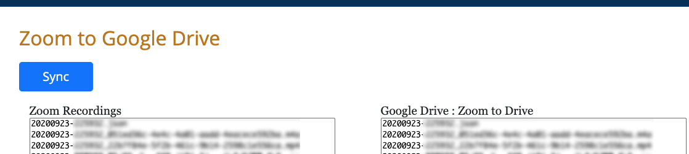

# zoomtodrive
This is a flask app which pulls a user's files from Zoom Cloud to a local
cache, then uploads the files to their Google Drive. It uses OAuth 2.0
for authenticating to both services.

You need to obtain OAuth client IDs and secrets from both [Google](https://developers.google.com/identity/protocols/oauth2) and
[Zoom](https://marketplace.zoom.us/docs/guides/auth/oauth).

See the example docker-compose file for other secrets that need to be
seeded.

